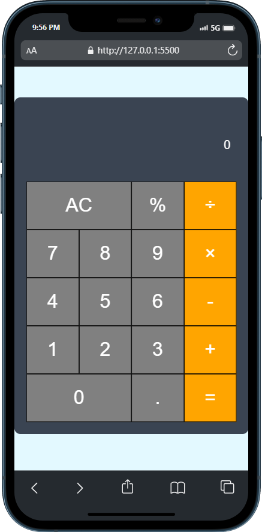

# Javascript Project

Membuat aplikasi kalkulator sederhana berbasis web dengan 3 file `html`, `css`, dan `javascript`. Adapun langkah untuk membuat aplikasi kalkulator sederhana ini, yaitu :

- Tambahkan html code ke index.html
- Tambahkan code CSS ke stylesheet.css
- Membuat aplikasi dapat menerima input dari tombol-tombol dan menampilkannya di layar display aplikasi kalkulator.
- Menyimpan angka-angka dan operator untuk melakukan kalkulasi.
- Mengaktifkan fungsi kalkulasi ke aplikasi calculatornya.
- Membuat tombol AC berjalan dengan lancar
- Membuat aplikasi dapat mengkalkulasi angka desimal.
- Menyelesaikan suatu masalah

## TOOLS

1. HTML
2. CSS
3. JavaScript

## UI KALKULATOR

`WEB`

`MOBILE`

